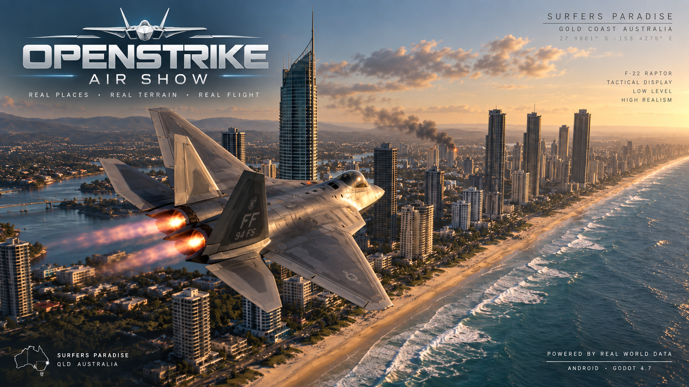

# OpenStrike

**A realism-focused combat flight prototype by DashOps, set over Australia's Gold Coast.**

Fly modern fighters, a stealth strike aircraft, or an Apache over coastal cities and mountain terrain. OpenStrike brings together aircraft-specific flight dynamics, detailed 3D models, cockpit instruments, guided weapons, and defensive flying in a controller-driven experience built with Godot.

Android is the primary platform, with web also a project target. **A Bluetooth controller is required for Android play.** Touch controls supplement the controller for settings, target selection, maps, and countermeasures.

## Flight and realism

The flight model makes airspeed, attitude, and energy matter. Lift, thrust, drag, and gravity determine the aircraft's motion; banking redirects lift into a turn, and pulling harder increases induced drag. Each jet has its own aerodynamic and engine profile, so changing aircraft changes how it flies as well as how it looks.

- **Angle of attack and stalls:** lift builds with angle of attack, then falls as the wing stalls. Separated-flow drag penalizes flying beyond the useful lift envelope.
- **Energy management:** parasite drag, induced drag, and a compressibility drag rise shape acceleration, climbs, and sustained turns.
- **Control authority:** aerodynamic response varies with airspeed, with aircraft-specific load limits, angle-of-attack limits, and pitch thrust vectoring where supported.
- **Engines:** thrust spools over time. Military power and afterburner affect acceleration, exhaust, and sound; the F-117 has no afterburner.
- **Aircraft motion and atmosphere:** sideslip correction, rudder forces, wing condensation, and vortices help communicate what the aircraft is doing. Exhaust follows actual engine power.
- **Rotorcraft dynamics:** the Apache offers an accessible Arcade mode and a separate Rotor mode with collective, cyclic, anti-torque yaw, translational lift, ground effect, and vortex-ring-state lift loss.

OpenStrike is still a playable prototype. Its jet speed envelope is deliberately compressed, and flight assists, combat pacing, damage, and seeker behavior are tuned for accessible play. Aircraft coefficients and stealth values are game models rather than validated real-world performance data. The realism emphasis is on believable forces, energy tradeoffs, visibility, and tactical decisions.

## Aircraft and 3D models

Five aircraft are selectable through the in-game settings. The F-35 is the default starting aircraft.

| Aircraft | Model and presentation | Flying character |
| --- | --- | --- |
| **F-35 Lightning II** | Detailed imported model with broad carrier-variant wing proportions, satin finish, stowed gear, single-engine exhaust, and an authored cockpit with a working multifunction display. | Stealth multirole profile with its own thrust, drag, and load limits. |
| **F-22 Raptor** | Textured imported model, twin-engine afterburners, authored cockpit, and animated trailing control surfaces. | Agile fighter profile with pitch thrust vectoring and a higher load limit. |
| **F-117 Nighthawk** | Distinctive faceted stealth model and aircraft-specific gear setup. Uses a clear forward camera and helmet-style HUD; a cockpit interior is not yet authored. | Lower thrust, earlier drag rise, and a more restrained flight envelope suited to deliberate strike flying. No afterburner. |
| **F/A-18F Super Hornet** | RAAF gunmetal/grey model in gear-up configuration, authored cockpit, twin exhaust plumes, and model-aligned weapon rails. | Conventional multirole fighter with a separate aerodynamic profile and no thrust vectoring. |
| **AH-64D Apache Longbow** | Detailed helicopter model with cockpit, turret/cannon, and target-orbit camera support. | Low-speed attack and hovering, with selectable Arcade and Rotor flight modes. |

Model orientation, scale, cockpit placement, exhaust positions, and weapon attachment points are tailored to the airframes. Cockpit detail and animation coverage vary by aircraft as development continues.

## Cockpit, HUD, and cameras

The interface combines flight instruments with cues that stay connected to the world outside the aircraft.

- **Flight HUD:** a world-referenced horizon and curved pitch ladder, flight-path marker, airspeed in knots, altitude in meters, Mach, and g readouts.
- **Targeting:** contact boxes, acquisition rings, lock and firing cues, and off-screen direction indicators. Camera tracking and weapon selection remain separate so looking around does not automatically change the weapon lock.
- **F-35 cockpit display:** a live heading-up terrain/contour radar-style presentation with contacts, selected target, ownship, and range information. Tap the display to change its range.
- **Tactical map:** a full-screen planning display with Satellite, Simple, and Terrain layers, contacts, adjustable range, pan/zoom, and routes of up to 12 waypoints. Opening it pauses flight. Waypoint direction and distance guide navigation after returning to the cockpit.
- **Camera options:** cockpit and external views, right-stick free look, target tracking, zoom, and a weapon camera that follows a launched missile or guided bomb through impact.
- **Incoming missile view:** R3 looks toward the nearest incoming missile from an external aircraft-relative view. Further presses cycle through the threats in nearest-first order, then return to the previous view. Flight control remains available during the glance.
- **Settings:** aircraft selection, flight options, audio levels, and persistent controller remapping with input detection.

The radar-style displays present game contacts for situational awareness; they are not a complete simulation of an operational radar suite.

## World, lighting, and weather

The main theatre covers roughly 50 km of the Gold Coast and Tweed region, combining real elevation data, streamed aerial imagery, and OpenStreetMap building footprints. Other selectable regional locations include Surfers Paradise, Burleigh Heads, Tweed Heads, and Mount Tamborine.

Procedural buildings give the cities their layout, while dedicated **Q1, Soul, and Ocean** tower models provide recognizable skyline landmarks. Facade materials, windows, and nighttime illumination add detail at low altitude. Terrain imagery streams and caches as needed, with greater detail near the aircraft; an internet connection is needed to download uncached areas.

Sun position can follow the theatre's geographic location, date, and time. Lighting presets, atmospheric fog, clouds, cloud shadows, and night lighting change the character of a flight. Clear, overcast, rain, and storm presets transition smoothly, with rain, wetness, and lightning effects. These are selectable weather conditions rather than a live weather feed.

## Weapons and combat

Jet loadouts include a cannon, rockets, heat-seeking missiles, radar-guided missiles, guided bombs, and guided ground-attack missiles. Weapons have distinct acquisition, propulsion, guidance, and engagement behavior.

- Cannon rounds and weapons use swept collision checks against terrain, buildings, and targets to detect impacts along their travel path.
- Heat seekers support fire-and-forget attacks. Player radar-guided missiles depend on retaining the selected target lock.
- Guided bombs are unpowered and use a release envelope based on altitude, speed, range, and forward alignment. Ground-attack weapons can guide toward a ground position captured at launch.
- Missiles have limited motor duration, lifetime, and turning ability. Terrain and buildings affect line of sight and can shield targets from blast effects.
- Enemy fighters pursue, seek a position behind the player, and use climbing or descending breaks and scissors. They react to incoming missiles and threatening gun alignment.
- Ground SAM sites defend city and hinterland areas. Drone threats provide additional interception encounters.

Ground impacts produce explosions, lingering flames, and rising, drifting smoke. Land strikes keep burning and smoking after the initial flash; **building hits produce larger, longer-lasting plumes**. Repeated nearby strikes renew the effect. Building damage is tracked without a full structural-collapse simulation.

### Surviving an engagement

Enemy aircraft and SAMs can acquire the player and launch missiles, with smoke trails that make their paths visible. The current introductory balance allows **one hostile missile at a time**, with a grace period after spawning or recovery and a breather between attacks.

- **Low-level masking:** SAMs can only acquire the player above **500 ft / 152.4 m above local terrain**, with an unobstructed line of sight. Dropping below that threshold or using terrain and buildings can break radar tracking.
- **Stealth:** the F-22, F-35, and F-117 use reduced radar signatures that shorten acquisition range and slow locking. Stealth improves the opportunity to evade; it does not make an aircraft invisible.
- **Heat management:** afterburner makes the player more attractive to heat seekers. Reducing power can help flares compete with the aircraft's heat signature.
- **Maneuvering:** seekers have finite turn authority and a limited tracking cone. Timed breaks and crossing a radar threat's line of sight can defeat tracking.
- **Countermeasures:** the on-screen button deploys flare/chaff decoys, using a replenishing supply and a cooldown. Decoys compete for seeker attention rather than guaranteeing an escape.
- **Threat warning:** a bottom-center lock/inbound notice leaves the main aiming area clear. Its red pulse and audible warning accelerate as the missile approaches. Projected brackets, shaded directional arrows, range, and behind-aircraft cues help locate the threat.

Hits produce visible explosion feedback and hull damage. Fatal damage leads to a brief falling, burning wreck sequence before recovery.

## Default jet controls

Bindings can be changed in Settings. Labels below show Xbox / PlayStation equivalents; Apache controls differ for collective, yaw, aiming, and orbiting.

| Control | Action |
| --- | --- |
| Left stick | Pitch and roll |
| Right stick | Look around |
| LT / L2 and RT / R2 | Left and right rudder; both triggers apply braking |
| B / Circle | Increase throttle |
| A / Cross | Decrease throttle; throttle holds when released |
| L3 | Fire cannon |
| LB / L1 | Fire the selected rocket, missile, or bomb |
| RB / R1 | Track target |
| X / Square | Cycle weapon; hold to open Settings |
| Y / Triangle | Open or close tactical map |
| D-pad up / down | Zoom in / out |
| D-pad left / right | Cycle jet views |
| R3 | Cycle incoming missile views; otherwise context-sensitive recenter / return / wings-level action |
| Touch: Countermeasures | Release flare/chaff decoys |
| Touch: Missile View | Access the weapon-following camera |

Tap a world target to select it. Use Settings to choose an aircraft and adjust the controller layout before flying.

## Repository layout

| Location | Contents |
| --- | --- |
| `assets/models/` | Aircraft, ground units, landmark models, their textures, and model credits |
| `assets/textures/` | Shared terrain/building textures and procedural noise resources |
| `assets/audio/` | Engine audio and source notes |
| `scenes/`, `scripts/`, `shaders/` | Game scenes, systems, and rendering code |
| `data/` | Regional terrain data and geographic attribution |
| `docs/` | Development notes, design plans, and project artwork |
| `docs/specs/` | [Original Android MVP specification](docs/specs/STRIKE_Android_MVP_Game_Spec.docx) |
| `tests/`, `tools/` | Automated checks, asset utilities, and development tools |
| `addons/`, `android/` | Godot plugins and Android platform integration |

`project.godot` and `export_presets.cfg` stay at the root so Godot can open and export the project. Generated imports and local builds are ignored by Git.

## Running from source

The project uses **Godot 4.7** with the **Compatibility** renderer. Development builds currently use Godot 4.7.2. Open `project.godot` in the editor, allow assets to import, connect a controller, and run the project.

```sh
godot --editor --path .
```

To launch directly after importing:

```sh
godot --path .
```

An Android export preset is included for ARM64 devices. Exporting requires matching Godot export templates and a configured Android SDK/JDK toolchain.

```sh
mkdir -p build
godot --headless --path . --export-debug "Android" build/OpenStrike.apk
```

Automated checks cover flight, weapons, and supporting systems:

```sh
GODOT_BIN=/path/to/godot tools/run_tests.sh
```

This is an actively developed single-player prototype. Flight tuning, aircraft presentation, combat balance, and platform support continue to evolve.

## Credits and contact

Created by **DashOps**. Third-party aircraft models, audio, imagery, and geographic data have their own source and attribution notes:

- [Aircraft models and asset credits](assets/models/ATTRIBUTION.md)
- [Terrain, imagery, and OpenStreetMap attribution](data/regions/ATTRIBUTION.md)
- [Engine audio source notes](assets/audio/README.md)

Find out more: [chris@dashops.au](mailto:chris@dashops.au).
